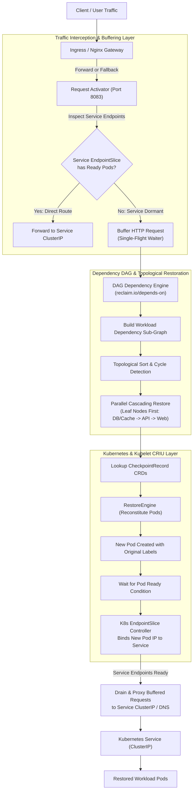

# Implementation Plan: Demand-Triggered Auto-Start & Multi-Pod Dependency Resolution for Checkpointed Workloads

## Goal Description
In the current system, workloads are continuously monitored, evaluated for inactivity via multi-signal telemetry, scored by the decision engine, and reclaimed via Kubelet CRIU checkpointing and pod eviction (with metadata preserved in `CheckpointRecord` CRDs). 

However, **once a pod is checkpointed and evicted, it does not automatically reconstitute and resume when incoming network/user traffic arrives**. Furthermore, production applications typically consist of **multiple cooperating pods with directional dependencies** (e.g., `frontend` $\to$ `backend-api` $\to$ `postgres`, `redis`). If a dependent service is hibernated or restored out of order, upstream services fail immediately due to broken sockets, connection refused (`ECONNREFUSED`), or database pool init failures.

This plan designs and implements:
1. **Demand-Triggered Request Activator & Buffer Gateway**: An intelligent, scale-from-zero HTTP/TCP traffic interceptor that buffers incoming client requests, coordinates on-demand CRIU restoration, and transparently replays buffered requests once workloads are ready.
2. **Multi-Pod Dependency Graph (DAG) Resolver**: A topological dependency engine that maps service relationships (`reclaim.io/depends-on`), detects cycles, and orchestrates cascading, bottom-up parallel restoration of prerequisite services before waking dependent parent pods.
3. **Single-Flight Synchronization & Concurrency Throttling**: Eliminates the "thundering herd" problem by deduplicating concurrent restore requests for the same service into a single restoration flight while queueing client requests.
4. **Readiness Verification & Endpoint Resolution**: Actively monitors container lifecycle and K8s readiness probes (`PodReadyCondition`) before routing buffered traffic to new Pod IPs.
5. **Reclamation Hysteresis & Warm-up Immunity**: Prevents flapping/thrashing by granting newly restored workloads a configurable grace period before idle scoring re-evaluates them.

---

## User Review Required

> [!IMPORTANT]
> **Traffic Interception Strategy**:
> To enable automatic wake-on-request without modifying application business code, we implement a lightweight **Request Activator Service (`pkg/activator`)** inside the scheduler binary and deployable as an Ingress/Service gateway.
> - For internal services (e.g. `backend-api` called by `frontend`), the Service routing can either point to the Activator when replica count is 0, or the Activator acts as an intelligent transparent reverse proxy.
> - For incoming cluster traffic, Nginx / Ingress directs traffic through the Activator endpoint when workloads are hibernated.

> [!WARNING]
> **Stateful vs Stateless Dependency Restoration**:
> While CRIU restores process memory (including heap and thread states), open TCP sockets to external hosts or databases may break if the remote peer closed the connection while the pod was checkpointed. 
> - **Recommendation**: For stateful databases like PostgreSQL, we support either keeping them running via `reclaim.io/protected: "true"`, OR performing TCP socket readiness verification before unblocking dependent API pods.

---

## Architecture: Demand-Triggered Auto-Start & Dependency Graph



---

## Technical Challenges & Solutions

| Challenge | Impact if Unaddressed | Architectural Solution |
| :--- | :--- | :--- |
| **Scale-to-Zero Traffic Drop** | When a checkpointed pod is evicted, K8s Service has 0 endpoints; incoming HTTP requests get `502 Bad Gateway` or `Connection Refused`. | **Request Activator**: Buffers HTTP requests in-memory with a configurable timeout (e.g., 30s), holds the client socket open, and flushes once the restored pod is Ready. |
| **Multi-Pod Dependencies (DAG)** | If `backend-api` wakes up but its dependent `postgres` and `redis` are still checkpointed, the backend immediately crashes with DB connection errors. | **DAG Dependency Engine**: Parses `reclaim.io/depends-on: "postgres,redis"`, computes topological order, restores leaves (data tier) first, verifies readiness, then wakes up the dependent API tier. |
| **Thundering Herd** | 100 concurrent requests arriving for an idle service trigger 100 simultaneous CRIU restore operations, causing race conditions and Kubelet overload. | **Single-Flight Restoration**: Uses `golang.org/x/sync/singleflight` keyed by `namespace/workload`. Only the first request triggers restoration; subsequent requests join the wait queue. |
| **Cyclic Dependencies** | If Service A depends on Service B, and Service B depends on Service A, sequential dependency restoration deadlocks. | **Cycle Detection & Parallel Resolution**: Strongly Connected Components (SCCs) are identified; cyclic clusters are triggered to restore in parallel with a shared deadline. |
| **Pod IP Mutation on Restore** | CRIU restore creates a new Pod with a new ephemeral cluster IP; clients or proxies hardcoding or caching raw Pod IPs will encounter connection drops. | **Kubernetes Service & EndpointSlice Abstraction**: Applications in K8s are exposed via a `Service` object with a `spec.selector`. When a restored pod is created, it retains the original labels (e.g. `app: backend-api`). The K8s `EndpointSlice` controller **automatically binds the new Pod IP** to the Service once the readiness probe passes. Upstream clients, Ingress, and the Activator route traffic to the **stable Service ClusterIP / DNS name** (`http://<service-name>.<namespace>.svc.cluster.local:<port>`), making Pod IP changes completely transparent. |
| **Reclamation Thrashing** | Pod wakes up to handle one request, then gets checkpointed again 10 seconds later because usage drops. | **Warm-up Hysteresis**: Restored pods are stamped with `reclaim.io/restored-at` and granted a 5–10 minute cooldown during which idle scoring returns `KEEP`. |

---

## Proposed Changes

### Component 1: Dependency Graph Engine (`pkg/dependency`)

We create a dedicated package to model, parse, and topologically resolve multi-pod workload dependencies.

#### [NEW] `adaptive-k8s-scheduler/pkg/dependency/types.go`
- Defines `DependencyNode`, `DependencyGraph`, `WorkloadReference`.
- Supports annotations:
  - `reclaim.io/depends-on`: comma-delimited list of dependencies in the same namespace (e.g., `"postgres,redis"`).
  - `reclaim.io/app`: groups pods into an application boundary (e.g., `"ecommerce"`).
  - `reclaim.io/startup-order`: optional explicit priority tier.

```go
package dependency

import "time"

type WorkloadKey struct {
    Namespace string
    Name      string
}

type DependencyNode struct {
    Key          WorkloadKey
    ServiceName  string
    Dependencies []WorkloadKey
    IsReady      bool
    IsHibernated bool
}

type RestorationPlan struct {
    Stages [][]WorkloadKey // Each stage contains workloads that can be restored in parallel
}
```

#### [NEW] `adaptive-k8s-scheduler/pkg/dependency/dag.go`
- Implements:
  - `BuildGraph(workloads []WorkloadInfo) *DependencyGraph`
  - `ResolveRestorationStages(target WorkloadKey) (*RestorationPlan, error)`: Computes the sub-graph of dependencies for `target`, performs topological sort (Kahn's algorithm), and groups independent workloads into parallel execution stages.
  - Cycle detection: falls back to parallel stage for cycle components with logged warning.

#### [NEW] `adaptive-k8s-scheduler/pkg/dependency/dag_test.go`
- Unit tests verifying:
  - Linear dependencies: `frontend -> backend -> postgres` $\to$ Stage 0: `[postgres]`, Stage 1: `[backend]`, Stage 2: `[frontend]`.
  - Diamond dependencies: `A -> [B, C] -> D` $\to$ Stage 0: `[D]`, Stage 1: `[B, C]` in parallel, Stage 2: `[A]`.
  - Independent services: only hibernated dependencies are included in the restoration plan; already running dependencies are skipped.
  - Cyclic detection handling without infinite loop.

---

### Component 2: Request Activator & Buffer Gateway (`pkg/activator`)

We implement the reverse proxy that catches traffic for dormant pods, buffers requests, and orchestrates the restore pipeline.

#### [NEW] `adaptive-k8s-scheduler/pkg/activator/buffer.go`
- Request buffering mechanism with timeout, max request body limit, and single-flight deduplication.
- Preserves headers, body, method, and URI.

#### [NEW] `adaptive-k8s-scheduler/pkg/activator/activator.go`
- An HTTP Reverse Proxy server listening on port `8083` (configurable).
- Intercepts requests destined for a target service (via Host header, path, or query parameter `x-target-service`).
- Inspects target workload health:
  - If target Service already has active, ready endpoints (`EndpointSlice.endpoints[*].conditions.ready == true`): immediately proxies request to the Service ClusterIP/DNS with low latency.
  - If target pod/service is checkpointed (0 ready endpoints, with corresponding `CheckpointRecord` in phase `Ready` or `Checkpointed`):
    1. Buffers the incoming request (body, headers, method, path).
    2. Resolves multi-pod dependency graph via `dependency.DAGResolver`.
    3. Triggers topological restore of unready dependencies, followed by the target workload pod.
    4. Waits for the Kubernetes `EndpointSlice` / Service endpoints to report `Ready: True` (`WaitUntilServiceReady(ctx, namespace, serviceName, timeout)`).
    5. Proxies the buffered request directly to the **Kubernetes Service ClusterIP / DNS name** (`http://<service-name>.<namespace>.svc.cluster.local:<port>`).
    6. Returns the live HTTP response to the client transparently.

#### [NEW] `adaptive-k8s-scheduler/pkg/activator/readiness.go`
- Service & EndpointSlice Informer/Watcher:
  - Tracks Kubernetes `v1.Service` and `discovery.k8s.io/v1.EndpointSlice` objects.
  - Detects when restored pods (which inherit the original `spec.selector` labels) are bound to the Service endpoints.
  - Verifies `Ready == True` on the Service's active endpoints before releasing buffered requests.
  - Benefits: Completely decouples the system from ephemeral Pod IP mutations, NAT, and multi-container port mappings by relying on native Kubernetes Service routing and `kube-proxy`.

---

### Component 3: Integration into Scheduler & Reclamation Daemon (`cmd/scheduler/main.go`)

#### [MODIFY] `adaptive-k8s-scheduler/cmd/scheduler/main.go`
- Initialize `dependency.DAGResolver` and `activator.NewActivatorServer(...)`.
- Expose Activator port `8083` alongside Prometheus (`9090`) and Telemetry API (`8081`).
- Hook the DAG resolver into `restoreForPendingDemand` and the `/api/v1/checkpoints/:ns/:name/restore` REST endpoint so manual and automated restores both execute dependency-aware cascading restorations.
- Ensure warm-up cooldown is recorded whenever a pod is auto-started by the activator.

---

### Component 4: Simulator & Active Workload Cluster Extension (`simulator/backend`)

To make this fully visible and testable in both Demo Mode 1 (Simulator) and Demo Mode 2 (Active Cluster):

#### [MODIFY] `simulator/backend/cluster/lifecycle.go`
- Add `ExecuteDependencyAwareRestore(ctx context.Context, namespace, rootWorkload string) ([]*WorkloadClusterState, error)`.
- When restoring a workload (e.g. `backend-api`), discover annotations on `test-idle-worker` or ecommerce pods.
- If dependencies exist in `StateCheckpointed` or `StateReclaimed`, restore them first in dependency order and record state transitions in `StateStore`.

#### [MODIFY] `simulator/backend/handlers/workloads.go`
- Add endpoint `POST /api/workloads/auto-start` or enhance `POST /api/workloads/restore`:
  - Accepts `{"namespace": "ecommerce", "name": "backend-api", "resolveDependencies": true}`.
  - Returns the list of all restored workloads in dependency sequence.

---

### Component 5: Reference Application Manifests (`cloud-ecommerce`)

#### [MODIFY] `cloud-ecommerce/kubernetes/deployments/backend-api.yaml`
- Add dependency annotations:
  ```yaml
  metadata:
    annotations:
      reclaim.io/checkpointable: "true"
      reclaim.io/depends-on: "postgres,redis"
      reclaim.io/app: "ecommerce"
  ```

#### [MODIFY] `cloud-ecommerce/kubernetes/deployments/frontend.yaml`
- Add dependency annotations:
  ```yaml
  metadata:
    annotations:
      reclaim.io/checkpointable: "true"
      reclaim.io/depends-on: "backend-api"
      reclaim.io/app: "ecommerce"
  ```

#### [MODIFY] `cloud-ecommerce/nginx/nginx.conf`
- Add fallback / proxy routing to the Activator so requests for sleeping services are transparently buffered and auto-started:
  ```nginx
  upstream backend-api {
      server backend-api:3000 max_fails=1 fail_timeout=5s;
      server adaptive-scheduler.kube-system.svc.cluster.local:8083 backup;
  }
  ```

---

## Verification Plan

### Automated Tests
1. **DAG & Dependency Resolution Test Suite**:
   ```bash
   cd adaptive-k8s-scheduler
   go test -v ./pkg/dependency/...
   ```
   - Test linear DAG: `Frontend -> Backend -> DB`
   - Test branch/diamond DAG: `App -> [Cache, ServiceB] -> DB`
   - Test cycle detection: `A <-> B` doesn't hang; resolves in parallel
   - Test skipping already active dependencies

2. **Activator & Buffer Test Suite**:
   ```bash
   cd adaptive-k8s-scheduler
   go test -v ./pkg/activator/...
   ```
   - Test request buffering and body streaming
   - Test single-flight deduplication (10 concurrent requests to dormant workload trigger 1 restore call)
   - Test timeout handling (client disconnect or slow workload return 504 Gateway Timeout cleanly)

3. **Full System Regression Tests**:
   ```bash
   cd adaptive-k8s-scheduler && go test ./...
   cd ../simulator && go test ./...
   ```

### Manual Verification
1. **Scale-to-Zero Verification**:
   - Checkpoint `test-idle-worker` or `backend-api` via dashboard or CLI.
   - Confirm pod is evicted and status is `RECLAIMED` / `Checkpointed`.
2. **Auto-Start on Request Verification**:
   - Send HTTP request to the service via curl:
     ```bash
     curl -i http://localhost:8083/api/products -H "X-Target-Service: ecommerce/backend-api"
     ```
   - Verify request is held while controller executes CRIU restore.
   - Verify dependencies (`postgres`, `redis`) are inspected and verified ready.
   - Verify response returns `200 OK` with payload as soon as the pod is ready.
3. **Multi-Pod Dependency Cascade Verification**:
   - Checkpoint both `backend-api` and `postgres`.
   - Send a request to `backend-api`.
   - Verify in logs and dashboard that `postgres` is restored **first**, enters `Ready`, and then `backend-api` is restored and served.
